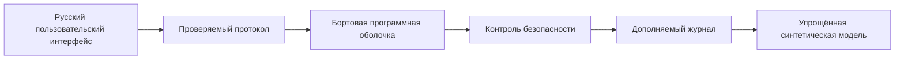

# SecFly

> **Только виртуальное моделирование**

SecFly — исследовательская платформа для моделирования отказоустойчивого управления автономным беспилотным аппаратом в полностью синтетической среде.

## Назначение и ограничения

Проект изучает проверяемое программное поведение только в виртуальной среде. Текущий ЭТАП 2 добавляет упрощённую детерминированную модель: локальные синтетические координаты, маршрут, заряд, паузу, ручной шаг и журнал. Потеря связи, неисправности и рабочий конечный автомат безопасности ещё не реализованы.

SecFly не подключается к реальным летательным аппаратам, датчикам, каналам управления или исполнительным устройствам. Запрещены выбор и сопровождение целей, преследование, наведение, вооружение, опасная полезная нагрузка, применение силы и противодействие системам подавления.

## Архитектура



Полное описание находится в [документации архитектуры](docs/architecture/system-context.md).

## Структура

- `apps/` — пять запускаемых оболочек;
- `packages/` — общие типы, протокол, часы, журнал и архитектурные контракты;
- `docs/` — ADR, безопасность и разработка;
- `infra/` — безопасные контейнерные файлы;
- `scenarios/` — место для будущих синтетических сценариев.

## Требования и запуск

Требуются Node.js 22 и pnpm 10.

```bash
corepack enable
pnpm install --frozen-lockfile
pnpm dev
```

Пользовательский интерфейс: `http://127.0.0.1:3000`, страница модели: `/simulation`. API Simulator: `http://127.0.0.1:4102/api/simulation/state`. Без Docker: `pnpm dev`. В контейнерах: `docker compose up --build`.

> Движение рассчитывается по упрощённой математической модели и не является физической моделью настоящего летательного аппарата.

## Проверки

```bash
pnpm format:check
pnpm lint
pnpm typecheck
pnpm test
pnpm test:coverage
pnpm architecture:check
pnpm build
pnpm check
```

## Дорожная карта

Следующие этапы описаны в [ROADMAP.md](ROADMAP.md). Нельзя реализовывать следующий этап без отдельного решения. Проект не предназначен для реального полёта или сертификации.
