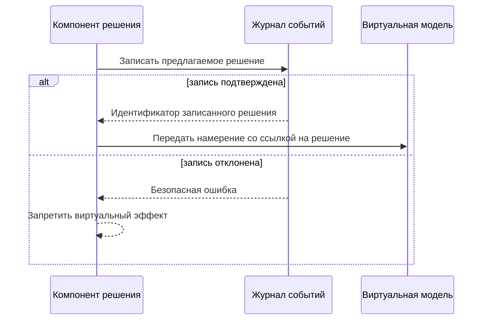

# ADR-0005: Запись решения до эффекта

- Статус: принято
- Дата: 2026-07-21

## Решение

Намерение виртуальной модели можно передать только после успешной записи соответствующего решения контроля безопасности. Ошибка журнала запрещает эффект. Повтор должен быть идемпотентным, а эффект обязан ссылаться на идентификатор записанного решения.

На ЭТАПЕ 1 реализуется только контракт и испытательная заглушка без движения аппарата.

