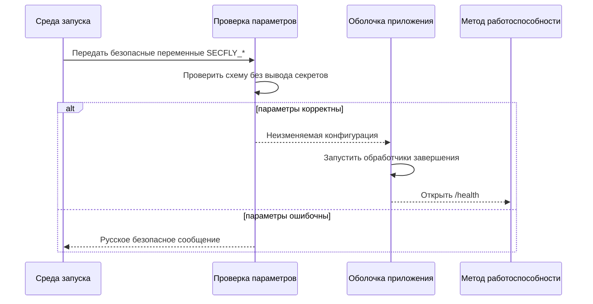

# Последовательность запуска каркаса

```mermaid
sequenceDiagram
    participant С as Среда запуска
    participant П as Проверка параметров
    participant О as Оболочка приложения
    participant Р as Метод работоспособности
    С->>П: Передать безопасные переменные SECFLY_*
    П->>П: Проверить схему без вывода секретов
    alt параметры корректны
        П-->>О: Неизменяемая конфигурация
        О->>О: Запустить обработчики завершения
        О-->>Р: Открыть /health
    else параметры ошибочны
        П-->>С: Русское безопасное сообщение
    end
```

SIGINT и SIGTERM инициируют `close()`. Ошибка порта или запуска журналируется по-русски и завершает процесс ненулевым кодом.
