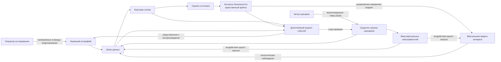
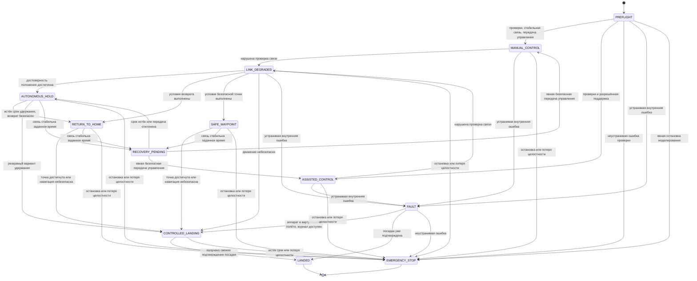
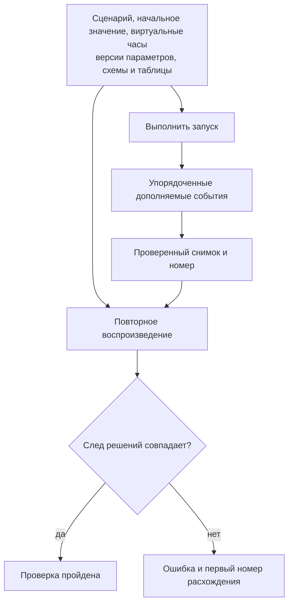

# Mermaid-диаграммы SecFly

## Системный контекст



## Trust boundaries и поток решения

```mermaid
sequenceDiagram
    autonumber
    participant R as Запуск сценария / интерфейс
    participant G as Шлюз данных
    participant E as Оценка состояния
    participant C as Бортовая логика
    participant S as Контроль безопасности
    participant L as Журнал событий
    participant V as Виртуальная модель

    R->>G: Версионируемая команда или неисправность
    G->>G: Проверка схемы, запуска, срока и повторов
    V-->>G: Синтетические показания датчиков
    G->>E: Доставленные наблюдения
    E->>E: Свежесть, расхождение, снижение достоверности
    E-->>C: Неизменяемая оценка состояния
    C->>S: Запрос смены режима
    S->>S: Разрешённый список, условия и приоритет
    S->>L: Принятое или отклонённое решение
    alt решение записано и принято
        L-->>S: Назначен порядковый номер
        S->>V: Намерение виртуальной модели
        V-->>L: Состояние модели изменено
    else запрос отклонён или запись не выполнена
        S-->>C: Эффекта нет; безопасный отказ
    end
```

## Конечный автомат



## Детерминированное повторное воспроизведение


