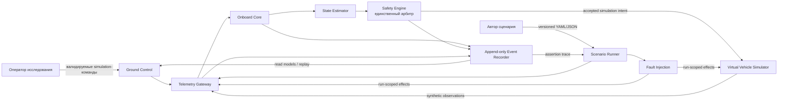
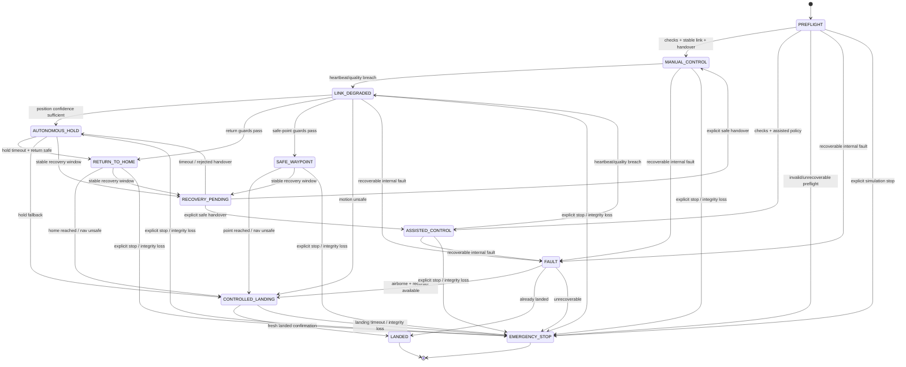
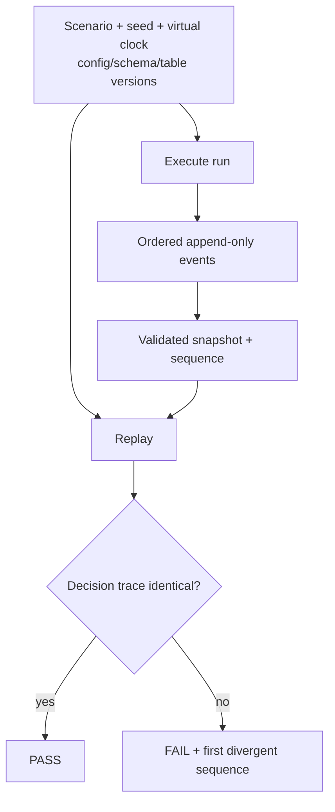

# Mermaid-диаграммы AeroGuard

## Системный контекст



## Trust boundaries и поток решения

```mermaid
sequenceDiagram
    autonumber
    participant R as Scenario Runner / GCS
    participant G as Gateway
    participant E as State Estimator
    participant C as Onboard Core
    participant S as Safety Engine
    participant L as Event Recorder
    participant V as Virtual Simulator

    R->>G: Versioned command or fault
    G->>G: Validate schema, run, expiry, idempotency
    V-->>G: Synthetic sensor samples
    G->>E: Delivered observations
    E->>E: Freshness, disagreement, confidence decay
    E-->>C: Immutable StateEstimate
    C->>S: ModeTransitionRequested
    S->>S: Whitelist + mandatory guards + priority
    S->>L: Accepted or rejected SafetyDecision
    alt decision persisted and accepted
        L-->>S: sequence assigned
        S->>V: Simulation intent
        V-->>L: SimulatorStateChanged
    else rejected or persistence failed
        S-->>C: No side effect; safe fallback/fault
    end
```

## State machine



## Детерминированный replay


